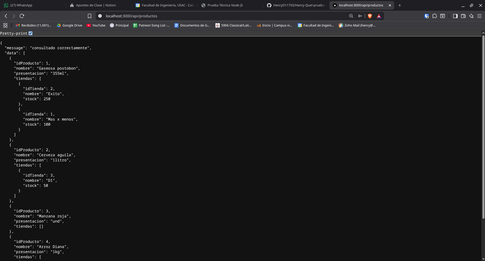
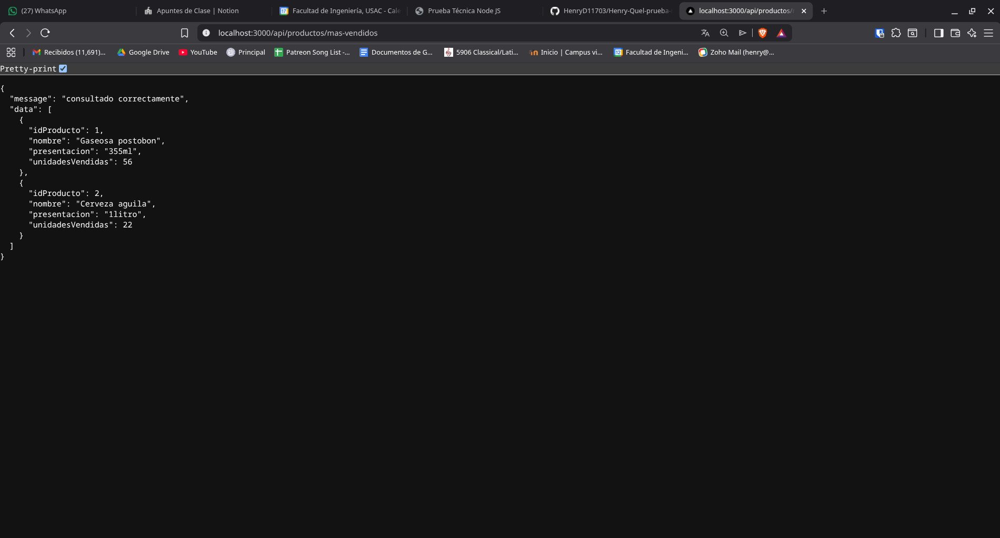
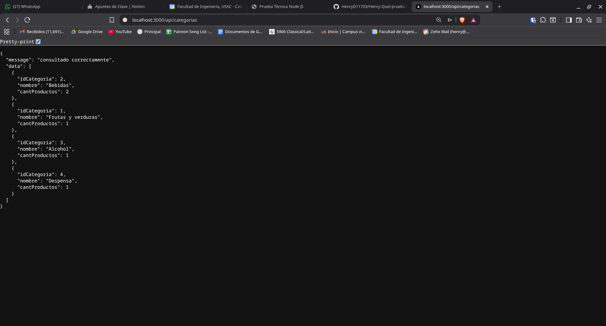
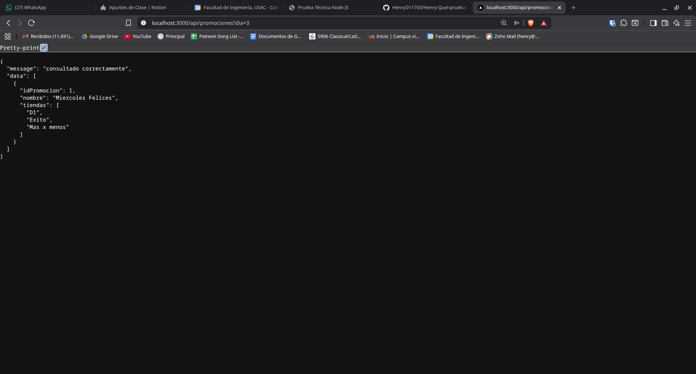

# API de Gestión de Mercado - Prueba Técnica Node.js


Esta es una API robusta desarrollada con Node.js, Express y Sequelize, diseñada para la gestión de productos, categorías y promociones de un mercado. La arquitectura sigue el patrón MVC (Modelo-Vista-Controlador) y se complementa con una capa de servicios para separar la lógica de negocio del acceso a datos.

## Requisitos Previos

Para ejecutar este proyecto, asegúrese de tener instalados los siguientes componentes:

* Node.js (Versión 18 o superior)
* Docker y Docker Compose
* Gestor de paquetes npm o yarn

## Instalación

1. Clonar el repositorio:
   ```bash
   git clone https://github.com/HenryD11703/Henry-Quel-prueba-node.git
   cd Henry-Quel-prueba-node
   ```

2. Instalar las dependencias:
   ```bash
   npm install
   ```

## Configuración del Entorno

El proyecto utiliza variables de entorno para gestionar la conexión a la base de datos y la configuración del servidor. Cree un archivo `.env` en la raíz del proyecto basado en `.env.example`:

```bash
cp .env.example .env
```

Las variables requeridas son:

* `DB_HOST`: Host de la base de datos (ej. localhost)
* `DB_USER`: Usuario de MySQL
* `DB_PASS`: Contraseña de MySQL
* `DB_NAME`: Nombre de la base de datos (market)
* `PORT`: Puerto donde correrá la API (si no se especifica, por defecto es 3000)
* `NODE_ENV`: Entorno de ejecución (development/production)

## Configuración de la Base de Datos

La infraestructura de la base de datos está contenedorizada con Docker. Para iniciar el servicio de MySQL y cargar el esquema inicial:

```bash
docker-compose up -d
```

Este comando levantará un contenedor de MySQL 8.0 y ejecutará automáticamente los scripts SQL ubicados en `./database/market.sql` y `./database/seeds.sql`.

## Datos de Prueba (Seeding)

El proyecto incluye un script de carga de datos iniciales para facilitar las pruebas de los endpoints.

*   **Carga Automática**: Al ejecutar `docker-compose up` por primera vez, los datos se cargarán automáticamente.
*   **Carga Manual**: Si desea resetear los datos de prueba sin reiniciar el contenedor, ejecute:
    ```bash
    npm run seed
    ```
    *Nota: Este comando truncará las tablas existentes y volverá a insertar los datos definidos en `database/seeds.sql`.*

## Ejecución de la API

Existen dos comandos principales para ejecutar el servidor definidos en `package.json`:

* **Modo Desarrollo (con recarga automática):**
  ```bash
  npm run dev
  ```

* **Modo Producción:**
  ```bash
  npm start
  ```

La API estará disponible por defecto en `http://localhost:3000/api`.

## Documentación de Endpoints

### Productos

#### Listar Productos y Stock
Retorna una lista de productos con su información básica y el stock disponible en cada tienda.
* **URL:** `/productos`
* **Método:** `GET`
* **Respuesta Exitosa:** `200 OK`



#### Top 10 Productos Más Vendidos
Lista los 10 productos con mayor volumen de ventas en orden descendente.
* **URL:** `/productos/mas-vendidos`
* **Método:** `GET`
* **Respuesta Exitosa:** `200 OK`



### Categorías

#### Categorías con Productos
Lista las categorías que tienen al menos un producto asociado, ordenadas por la cantidad de productos de forma descendente.
* **URL:** `/categorias`
* **Método:** `GET`
* **Respuesta Exitosa:** `200 OK`



### Promociones

#### Promociones por Día
Permite filtrar las promociones vigentes según un día específico de la semana.
* **URL:** `/promociones`
* **Método:** `GET`
* **Parámetros de Query:** 
    * `dia` (Requerido): Un número del 1 (Lunes) al 7 (Domingo).
* **Respuesta Exitosa:** `200 OK`
* **Error de Validación:** `400 Bad Request` (Si el día es inválido o no se proporciona).



## Estructura del Proyecto

* `src/config`: Configuración de base de datos y variables globales.
* `src/controllers`: Manejadores de las solicitudes HTTP.
* `src/models`: Definiciones de modelos de Sequelize y asociaciones.
* `src/routes`: Definición de rutas y asignación de middlewares.
* `src/services`: Lógica de negocio y consultas a la base de datos.
* `src/middlewares`: Gestión de errores y validaciones técnicas.
* `src/utils`: Utilidades y formateadores de respuesta consistentes.